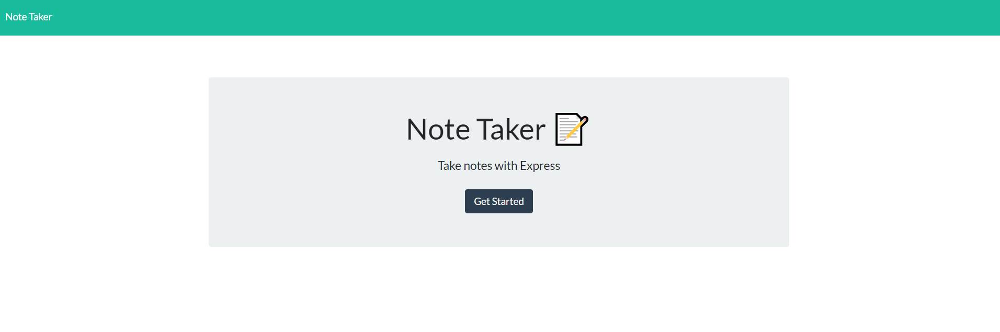
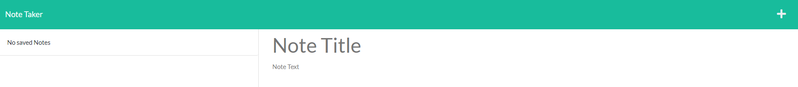
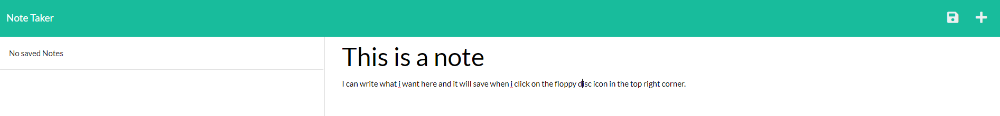
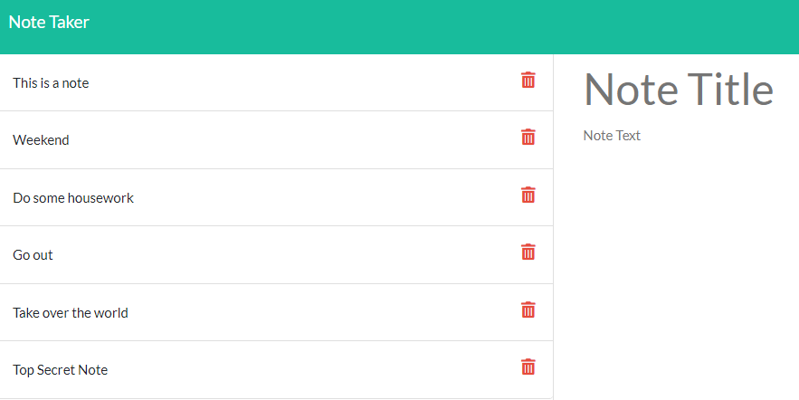
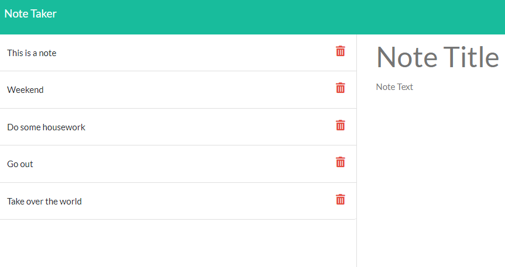

# Express.js Note Taker

## Description
We were tasked to modify the starter code to create an application called 'Note Taker'. The purpose of Note Taker is too write and save notes that a user inputs. Having been provided with the front end the challenge was about connecting the back end to the front end and then deploying the entire application to Heroku. 

This was an important exercise as it was an opportunity to implement the skills and knowdlege we had learnt over the past week about express.js. 

The main takeaway i learnt from this exercise was you need to have a good file structure so that you can easily connect the front end and back end together. Additionally it is important to understand when to use GET, POST and DELETE methods. 

To give the application on Heroku click here: [View application on Heroku](https://mwest-note-taker.herokuapp.com/)

## Table of Contents
- [Installation](#installation)
- [Usage](#usage)
- [Features](#features)
- [Contribute](#contribute)
- [License](#license)

## Installation
Once the user has cloned the project from GitHub there are a very steps they must undertake in order to get the application running. 
They must first open the command line and then type in 'npm install' or 'npm i'. This will download the neccessary dependencies so that the application functions. 

## Usage
To use the application the user can simply click on the link to view the application: https://mwest-note-taker.herokuapp.com/

This will take them to the homepage. 

The user can then click "Get Started" and be re-directed to a new page which allows them to take notes. 

They will be displayed with the following page with 'no saved notes'. 

The user can enter a note title and note text, and select the floopy disc in the top right corner to save the note. 

The process can be repeated and a number of notes can be saved. 

If you user wants to delete a note that simply click on the red bin and the note is removed. 

The user can also select the + icon at any time to start a new note. 

## Features
- Express.js
- UUID

## Contribute
If you would like to contribute to this project please contact me via email at mjhwest89@gmail.com

## License
This project is released under the [MIT LICENSE](https://github.com/mjhwest/note-taker/blob/main/LICENSE)